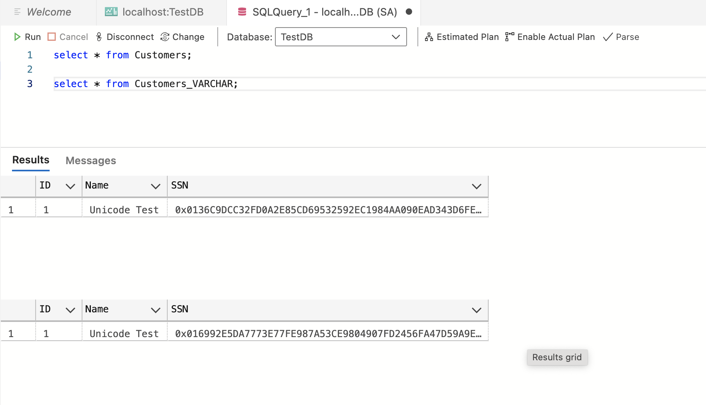

# 🛡️ Encrypted Customer Demo

This project demonstrates how to use **Always Encrypted with Azure Key Vault** in a **Spring Boot + SQL Server** application.

It uses:

- Spring Boot (Java 21)
- SQL Server 2022 with Always Encrypted
- Azure Key Vault integration
- Docker & Docker Compose

---

## 🎯 Goal of the Example

The purpose of this example is to **validate the difference between encrypting `VARCHAR` and `NVARCHAR` columns** using Always Encrypted in SQL Server.

- `VARCHAR` does **not handle Unicode characters properly**. When a Unicode character is saved, it gets stored as **garbage characters**.
- When such a `VARCHAR` value is updated, the encryption happens using those garbage characters, and the result is a **corrupted encrypted value that cannot be decrypted correctly**.
- `NVARCHAR`, on the other hand, supports Unicode and encrypts the data properly, preserving characters like emojis, accents, or symbols.

This demo helps visualize and test this behavior by saving and updating records in both encrypted column types and observing the outcome.

---

## 🚀 Getting Started

### ✅ Prerequisites

- Docker
- Docker Compose
- Java 21 (if running Spring Boot locally)
- Azure Key Vault setup with a key and access for a service principal

---

## ⚙️ Configuration

All secrets and connection details are stored in a `.env` file. You’ll need to create one in the root directory.

### 🔐 Create `.env`

```env
# SQL Server
SA_PASSWORD=YourStrong!Passw0rd
AKV_KEY_PATH=https://<your-key-vault>.vault.azure.net/keys/<your-key-name>/<key-version>

# Azure Credentials
AZURE_CLIENT_ID=your-azure-client-id
AZURE_CLIENT_SECRET=your-azure-client-secret
AZURE_TENANT_ID=your-azure-tenant-id

# Spring Boot DB config
SPRING_DATASOURCE_URL=jdbc:sqlserver://sqlserver:1433;databaseName=TestDB;encrypt=true;trustServerCertificate=true;columnEncryptionSetting=Enabled;
SPRING_DATASOURCE_USERNAME=sa
SPRING_DATASOURCE_PASSWORD=YourStrong!Passw0rd
```

> ❗ **Never commit your `.env` file.** A sample `.env.example` is included for reference.

---

## 🐳 Running with Docker

### 🔨 Step 1: Build and Start the App

```bash
docker-compose up --build
```

This will:

- Build the Spring Boot app
- Start SQL Server and register the Azure Key Vault provider
- Run the database initialization script (including Always Encrypted setup)

### 🛑 Stopping

```bash
docker-compose down
```

---

## 🧪 Running Tests

```bash
./mvnw test
```

Tests are configured to **disable AKV** via the `test` Spring profile and avoid connecting to Azure during test runs.

---

## 🔍 How to Test the Unicode Encryption Behavior

### 1. Insert Customers (Both Tables)

```bash
curl -X POST http://localhost:8080/customers \
  -H "Content-Type: application/json" \
  -d '{"name": "Unicode Test", "ssn": "´Ñ Unicode"}'
```

This inserts a record into:
- `Customer` table (with NVARCHAR encrypted columns)
- `Customer_VARCHAR` table (with VARCHAR encrypted columns)

---

### 2. View the Data in SQL Server

Open your database and query both tables. Observe:

- Customer and Customer_VARCHAR data is stored and encrypted correctly.
- But note that both values are different.

📸 **Screenshot: Data from both tables in SQL Server**



---

### 3. List All Customers

```bash
curl http://localhost:8080/customers/all
```

✅ You will see two records with the different content. NVARCHAR handles it correctly meanwhile VARCHAR does not. This is the first issue of using VARCHAR with unicode content on encrypted columns.

```xml
<ArrayList>
    <item>
        <name>Unicode Test</name>
        <id>1</id>
        <type>VARCHAR</type>
        <ssn>´Ñ Unicode</ssn>
    </item>
    <item>
        <name>Unicode Test</name>
        <id>1</id>
        <type>NVARCHAR</type>
        <ssn>´Ñ Unicode</ssn>
    </item>
</ArrayList>
```
---

### 4. Update the VARCHAR Customer

Note that the only value updated is name, however as far as the update is using JPA, everything is updated and here is where the second issue is generated.

```bash
curl -X PATCH http://localhost:8080/customers/varchar \
  -H "Content-Type: application/json" \
  -d '{"id": 1, "name": "Unicode Test Updated"}'
```

---

### 5. List All Customers Again

```bash
curl http://localhost:8080/customers/all
```

❌ You will now get an error when trying to read the `VARCHAR` encrypted value:

```xml
<HashMap>
    <details>Could not extract column [3] from JDBC ResultSet [Specified ciphertext has an invalid authentication tag. ] [n/a]</details>
    <error>Error retrieving customers</error>
</HashMap>
```


---

## 📁 Project Structure

```
.
├── springboot-app/
│   ├── Dockerfile
│   ├── src/main/java/...
│   └── target/demo.jar
├── sqlserver/
│   ├── Dockerfile
│   ├── init-sql/
│   │   ├── setup.sql.template
│   │   └── entrypoint.sh
├── screenshots/
│   ├── 01-api-insert-result.png
│   ├── 02-database-view.png
│   └── 03-error-decryption-failed.png
├── docker-compose.yml
├── .env               # Not committed
└── .env.example       # Sample config
```

---

## 🧰 Useful Commands

### Rebuild without cache:

```bash
docker-compose build --no-cache
```

### View logs:

```bash
docker-compose logs -f
```

---

## 🧠 Notes

- The SQL Server image runs an entrypoint script to **inject sensitive values** (like the Key Vault path) into the SQL initialization script using `envsubst`.
- Spring Boot registers the AKV provider using environment variables at runtime.
- You can disable AKV initialization by setting this in `application-test.properties`.

---

## 📬 Contact

If you have questions, feel free to open an issue or contact the project maintainer.
